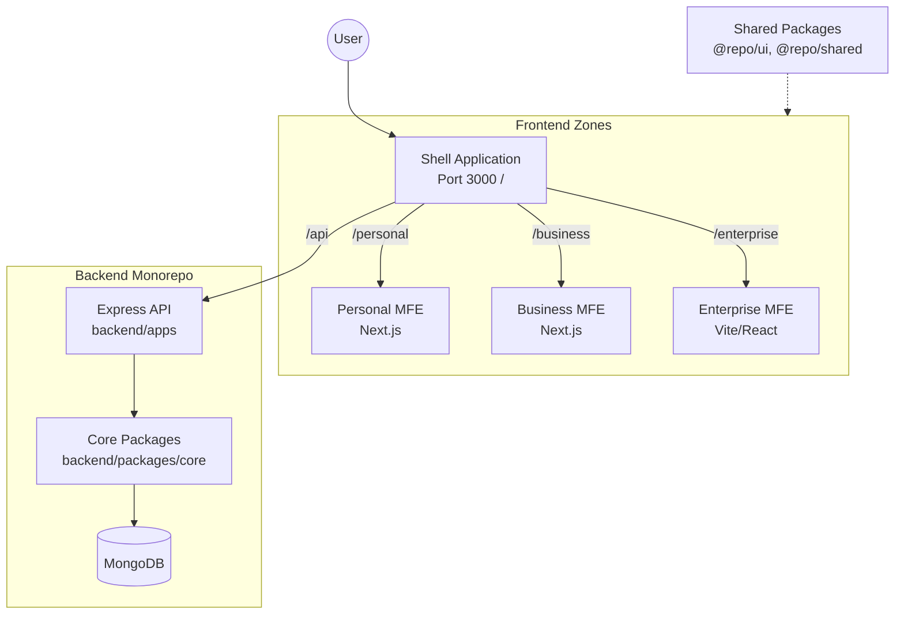

# BizzAI ERP: Architecture Analysis (March 2026)

This document provides a definitive overview of the BizzAI ERP architecture, reflecting recent major refactors including Backend Repository patterns and Frontend FSD alignment.

## 🏛️ High-Level System Architecture

The system is designed as a **Monorepo** governing multiple **Micro-Frontends (MFEs)** that communicate with a unified **Backend API Service**.

---

## 🛰️ Frontend: Micro-Frontend (MFE) Strategy

The frontend follows a **Multi-Zone Next.js** architecture, stitched together by a central Shell.

### 1. The Shell (Auth) Gateway
- **Primary Entry**: Port 3000.
- **Routing**: Uses Next.js rewrites to proxy requests to appropriate MFEs based on path prefixes (`/personal`, `/business`, `/enterprise`).
- **Auth Persistence**: Centralized authentication using **Zustand** and `localStorage`, broadcasting logout events via `BroadcastChannel`.

### 2. Unified Architectural Pattern: Feature-Sliced Design (FSD)
To ensure system-wide maintainability, all MFEs must adhere to the **FSD** architectural pattern. This standardizes how code is organized by domain and responsibility.

**The 6 Standard Layers (ordered by dependency):**
1.  **`app/`**: Global initialization (Providers, Global Styles, Shell integration).
2.  **`pages/`**: Single-responsibility view compositions (e.g., `DashboardPage`).
3.  **`widgets/`**: Multi-feature UI fragments (e.g., `Header`, `FinanceSummary`).
4.  **`features/`**: Interactive domain logic with high value (e.g., `JournalPosting`).
5.  **`entities/`**: Core business models and data structures (e.g., `User`, `Bill`).
6.  **`shared/`**: Generic, logic-free UI and utility functions (e.g., `Button`, `apiClient`).

---

## 📊 Pattern Alignment Audit (March 2026)

This table tracks the current architectural consistency across the frontend ecosystem.

| Application | Pattern | FSD Layers | Alignment Status | Actions Required |
| :--- | :--- | :--- | :--- | :--- |
| **Personal** | FSD | Full | **Aligned** | None. |
| **Business** | FSD | Full | **Aligned** | None. |
| **Enterprise**| Hybrid FSD | Partial | **Drifting** | Move `views` to `pages/widgets`; move `hooks` to `shared`. |
| **Auth Shell**| Flat/Legacy | Minimal | **Legacy** | Full refactor to FSD layers. |

---

### 3. State Management Matrix
- **Stateful Prefetching**: `ModuleRegistry.ts` handles lazy-loading and pre-fetching of modules to minimize Time-to-Interactive (TTI).
- **Complex Modules**: Uses **Redux Toolkit** (Enterprise) and **React Query** (Server State).
- **UI State**: Uses **Zustand** for lightweight, localized state.

---

## 🛠️ Backend: Monorepo & Repository Pattern

The backend has transitioned to a highly decoupled and type-safe architecture.

### 1. Decoupled Data Access
The system now uses a structured Repository pattern to isolate business logic from database concerns:
- **`BaseRepository`**: An abstract base class providing common CRUD operations and type-safe MongoDB interactions.
- **`ConfigService`**: Centralized configuration management, replacing ad-hoc environment variable access.

### 2. Monorepo Organization
- **`backend/apps/`**: Deployment-ready service entry points (e.g., `enterprise`, `personal`).
- **`backend/packages/core/`**: The heart of the system, containing:
    - **Controllers**: Handle HTTP requests.
    - **Services**: Contain pure business logic.
    - **Repositories**: Encapsulate Mongoose/MongoDB query logic.

---

## 🔄 Cross-App Communication & Shared Infrastructure

### 1. Shared Platform Layer (`packages/`)
- **`@repo/ui`**: Atomic UI library using **Tailwind CSS v4**.
- **`@repo/shared`**: Shared Zod schemas, types, and the centralized `apiClient`.
- **`@repo/design-tokens`**: Governs themes, colors, and typography across all MFEs.

### 2. Communication Patterns
- **Event Bus**: MFEs communicate asynchronously via the `BroadcastChannel` Event Bus for system-wide notifications (e.g., `AUTH_LOGOUT`).
- **Unified API**: All MFEs call `/api/*`, which the Shell rewrites to the Backend Gateway, eliminating CORS issues.

---

## 🔒 Security & Routing
- **JWT Authentication**: Handled at the Shell level, with tokens shared across zones via `localStorage` and `auth_token` cookies.
- **Path-Based Rewrites**: Ensures framework assets (e.g., `/_next/*`) are correctly routed to the origin MFE without browser-side complexity.
