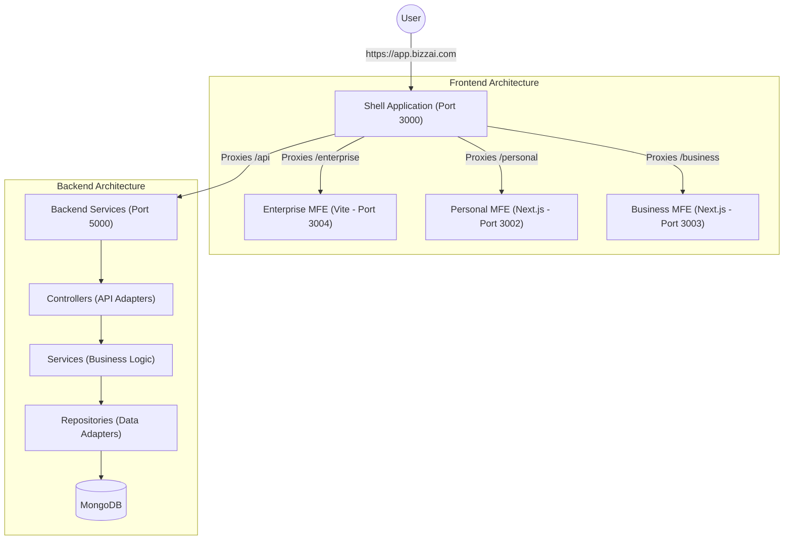

# SmartERPAI Architectural Flow

## 1. System Overview

SmartERPAI is built on a distributed micro-frontend architecture with a centralized, modular backend. This allows for independent development across different business domains while maintaining a unified user experience.

---

## 2. Frontend Architecture

### Multi-Zone Routing
The Shell application acts as the primary gateway using **Next.js Multi-Zones**. It uses `next.config.ts` rewrites to dynamically route requests to different MFEs based on the URL path.

- **Shell (Auth)**: Handles authentication and global navigation.
- **Next.js MFEs**: Follow standard Next.js conventions with `basePath` configuration.
- **Vite MFEs**: Integrated seamlessly via proxies, allowing for high-performance React applications within the same domain space.

### Feature-Sliced Design (FSD)
Frontend code is organized using **FSD principles**, ensuring strict separation of concerns:
1.  **Shared**: Core utilities, UI components (Tailwind-based), and configuration.
2.  **Entities**: Domain-specific data structures (e.g., User, Invoice, Product).
3.  **Features**: User actions with business value (e.g., `create-invoice`, `process-payment`).
4.  **Widgets**: Composable UI units (e.g., `FinancialDashboard`, `ProductList`).
5.  **Pages**: Full views constructed from widgets and features.

---

## 3. Backend Architecture

### Modular Hexagonal Pattern
The backend adheres to a **Hexagonal (Ports and Adapters)** architecture, implemented through a modular structure:

- **Modules**: Domain-specific folders (e.g., `finance`, `inventory`, `sales`) containing their own controllers and services.
- **Dependency Injection**: Utilizes `tsyringe` for loose coupling between components.
- **Infrastructure**: Native MongoDB driver is used directly in Repositories, moving away from Mongoose to improve performance and transactional control.

#### Request Flow Example:
1. **Controller**: Receives the Express request, extracts the `tenantId` from the context, and calls a Service method.
2. **Service**: Encapsulates business rules (e.g., validating a journal entry balance) and interacts with Repositories.
3. **Repository**: Executes optimized MongoDB queries, often using `ClientSession` for ACID transactions.

---

## 4. Multi-tenancy & Cross-Cutting Concerns

### Tenant Resolution
The system implements **Isolating Multi-tenancy** at the logical level:
- **Middleware**: [tenantResolver.ts](file:///c:/Users/vigne/Project/30/ERP/backend/src/middlewares/tenantResolver.ts) extracts the tenant slug from the Host or Origin header.
- **Context Preservation**: The `tenantId` is attached to the request object and propagated through Services to Repositories.
- **Data Partitioning**: All database collections use a `tenantId` field to ensure data isolation.

### Security and Observability
- **Authentication**: JWT-based auth handled by the Shell and verified by backend middleware.
- **Validation**: Zod is used across the system for schema validation and type safety.
- **Monitoring**: Sentry integration for error tracking and performance profiling.
