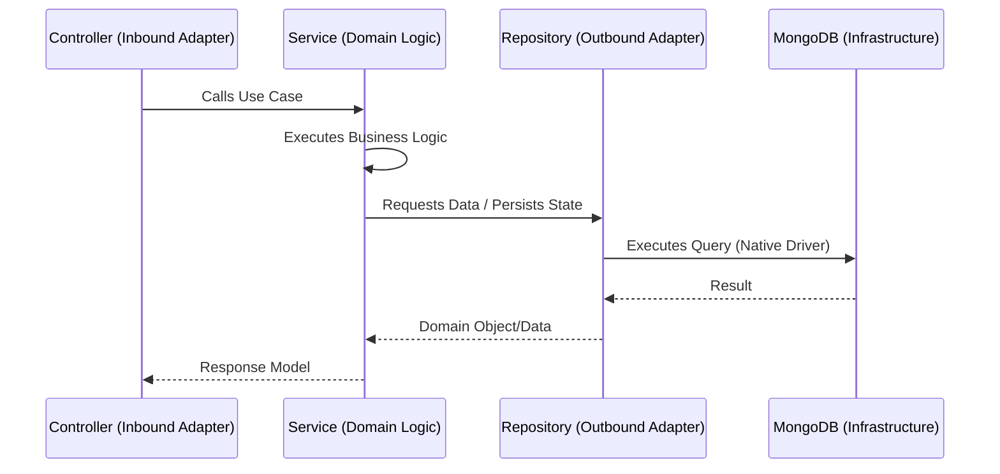

# Project Architecture Overview: BizzAI ERP

As the Senior Technical Architect, I am providing a detailed architectural flow of the BizzAI ERP project. This system is designed for high scalability, modularity, and independent deployability across both frontend and backend.

## 🏛️ High-Level System Architecture

The project follows a **Micro-Frontend (MFE)** approach on the frontend and a **Modular Monolith with Hexagonal/Clean Architecture** on the backend.

```mermaid
graph TD
    User((User)) --> Shell[Shell Application <br/> Port 3000]
    
    subgraph Frontend_MFEs [Micro-Frontends]
        Personal[Personal MFE <br/> Next.js | Port 3002]
        Business[Business MFE <br/> Next.js | Port 3003]
        Enterprise[Enterprise MFE <br/> Vite + React | Port 3004]
    end

    subgraph Shared_Layer [Shared Packages]
        UI[ui-components]
        Shared[shared-logic]
        Tokens[design-tokens]
    end

    Shell -- Rewrites /personal --> Personal
    Shell -- Rewrites /business --> Business
    Shell -- Rewrites /enterprise --> Enterprise
    
    Personal -.-> Shared_Layer
    Business -.-> Shared_Layer
    Enterprise -.-> Shared_Layer

    Shell -- API Proxy /api --> Backend[Backend Service <br/> Node.js | Port 5000]
    
    Backend --> MongoDB[(MongoDB)]
```

---

## 🛰️ Frontend Architecture: Next.js Multi-Zones

The frontend is a collection of independent applications (Zones) that appear as a single site to the end user.

### 1. The Shell (Gateway)
- **Role**: Entry point for all users. Handles authentication and routing.
- **Routing**: Uses Next.js **rewrites** to proxy requests to sub-apps based on the URL path.
- **Port**: 3000

### 2. Micro-Frontends (MFEs)
- **Personal & Business**: Built with Next.js for SSR/SEO needs.
- **Enterprise**: Built with Vite + React, optimized for heavy ERP functionality. It follows **Feature-Sliced Design (FSD)** for internal organization.
- **Shared Packages**: Located in `frontend/packages/`, providing a unified design system and common utilities.

### 3. Feature-Sliced Design (FSD) in Enterprise
The Enterprise MFE is structured into layers:
- `app`: Global settings, providers.
- `pages`: Viewable screens.
- `widgets`: Complex combinations of features.
- `features`: User actions (e.g., `AddCustomer`).
- `entities`: Business objects (e.g., `Customer`, `Order`).
- `shared`: Reusable components, hooks, and API clients.

---

## ⚙️ Backend Architecture: Hexagonal / Clean Architecture

The backend is a Node.js/Express application organized into domain modules, adhering to Hexagonal Architecture principles to decouple business logic from infrastructure.

### 1. Modular Structure
Each domain (e.g., `finance`, `crm`, `inventory`) is isolated in its own module directory.

### 2. Implementation Layers (Hexagons)
Within each module, the flow is strictly unidirectionally dependencies:



- **Controller**: Handles HTTP requests, input validation (via Zod), and returns HTTP responses.
- **Service**: The "Heart" of the system. Contains core business logic, rules, and orchestrates workflows.
- **Repository**: Handles interaction with MongoDB using the native driver. Responsible for data persistence and encryption/decryption (e.g., account numbers).
- **Dependency Injection**: Uses `tsyringe` to manage dependencies and promote testability.

---

## 🔄 End-to-End Data Flow

1. **User Request**: A user navigates to `/personal/finance/dashboard`.
2. **Shell Routing**: The Shell intercepts the request and proxies it to the Personal MFE (Port 3002).
3. **MFE Data Fetching**: The Personal MFE makes a call to `/api/finance/accounts`.
4. **Shell API Proxy**: The Shell rewrites `/api/*` to `http://localhost:5000/api/*`.
5. **Backend Entry**: The Backend `finance` router directs the request to `CashBankController.ts`.
6. **Execution**:
    - `CashBankController` resolves `CashBankService`.
    - `CashBankService` calls `CashBankRepository.getAccounts()`.
    - `CashBankRepository` executes a native MongoDB query.
7. **Response**: Data flows back up through the repository, service, controller, Shell proxy, and finally to the user's browser for rendering.

---

## 🛠️ Tech Stack Summary

| Layer | Technologies |
| :--- | :--- |
| **Frontend Shell** | Next.js, Tailwind CSS |
| **Micro-Frontends** | Next.js, Vite + React, FSD |
| **Shared UI** | React, Tailwind, Design Tokens |
| **Backend Core** | Node.js, Express, TypeScript |
| **Backend DI** | tsyringe |
| **Database** | MongoDB (Native Driver), Migrating from Mongoose |
| **Validation** | Zod |
| **Infrastructure** | Docker, TurboRepo |
