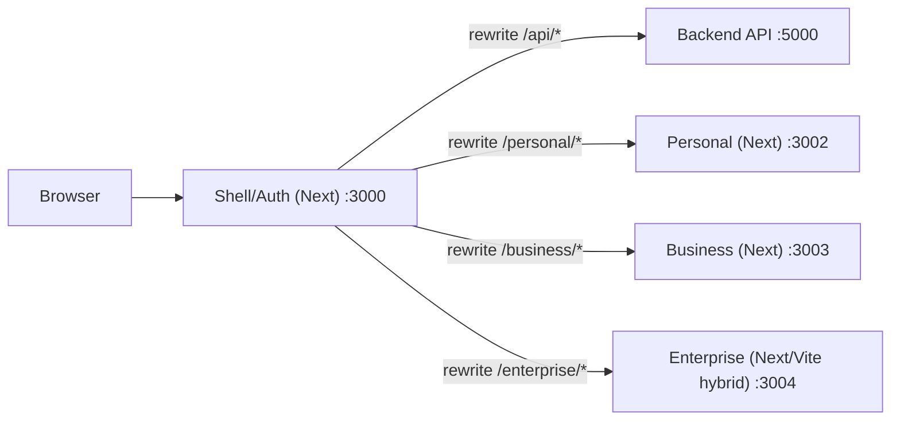

# Frontend Architecture (BizzAI ERP)

This document describes the **complete frontend architecture** as implemented in this repository, including the monorepo layout, micro-frontend composition, routing, state/data patterns, shared packages, build/CI, and deployment considerations.

---

## 1) Architectural Goals

- **Single-product experience** with independently developed domains (Personal / Business / Enterprise).
- **Shared UI + shared types/business logic** to reduce duplication and enforce consistency.
- **Consistent API access** via a single `/api` surface, avoiding CORS complexity.
- **Composable state**: local UI state stays local; cross-app state is explicitly shared (auth, events, types).
- **Fast iteration** with a workspace + Turbo pipeline and incremental builds.

---

## 2) Repository Layout (Frontend)

Top-level:

```text
frontend/
  apps/                 # User-facing apps (Personal/Business/Enterprise)
  mfe/                  # Micro-frontends (shell/auth + domain MFEs)
  packages/             # Shared libraries published via workspace imports
  common/               # Shared “product” packages (e.g. network layer)
  turbo.json            # Turbo task graph
  package.json          # Frontend workspaces + turbo scripts
```

Root orchestrator:

- Monorepo workspaces are declared in `C:\Users\avmvi\Project\ERP\package.json`.
- Frontend uses Turbo scripts from `C:\Users\avmvi\Project\ERP\frontend\package.json`.

---

## 3) Runtime Architecture: Shell + Zones + MFEs

### 3.1 High-level composition

The system uses **path-based composition**:

- A **Shell (Auth)** app is the primary entrypoint.
- Domain apps mount under stable base paths:
  - `/personal`
  - `/business`
  - `/enterprise`

In local development these are separate processes/ports, stitched together by the Shell via Next.js rewrites.



### 3.2 Shell (Auth) responsibilities

The Shell is implemented at:

- `C:\Users\avmvi\Project\ERP\frontend\mfe\common\auth`

Key responsibilities:

1. **Single entry URL** in dev: `http://localhost:3000`
2. **Path-based routing to zones** via rewrites (multi-zone style) in:
   - `C:\Users\avmvi\Project\ERP\frontend\mfe\common\auth\next.config.ts`
3. **Backend API proxy**:
   - Requests to `/api/*` are forwarded to the backend (local default: `http://localhost:5000/api/*`)

### 3.3 Domain apps

#### Personal (Next.js zone)
- Location: `C:\Users\avmvi\Project\ERP\frontend\apps\personal`
- Base path: `/personal` via:
  - `C:\Users\avmvi\Project\ERP\frontend\apps\personal\next.config.ts`

#### Business (Next.js zone)
- Location: `C:\Users\avmvi\Project\ERP\frontend\apps\business`
- Base path: `/business` via:
  - `C:\Users\avmvi\Project\ERP\frontend\apps\business\next.config.ts`

#### Enterprise (mixed implementation)
- Location: `C:\Users\avmvi\Project\ERP\frontend\apps\enterprise`
- Contains both:
  - Next.js config with basePath `/enterprise` (`C:\Users\avmvi\Project\ERP\frontend\apps\enterprise\next.config.ts`)
  - A Vite SPA entry (`C:\Users\avmvi\Project\ERP\frontend\apps\enterprise\index.html`) that mounts `src/app/main.tsx`

Architectural note:
- The repo currently includes **both** Next and Vite artifacts for Enterprise. Treat this as a “decision point”: choose one as canonical for production, or document a strict split (e.g., Vite for module federation host, Next for SSR shell) and align scripts + deployment accordingly.

---

## 4) Routing Model

### 4.1 Multi-zone routing (Shell)

The Shell rewrites both:

- App pages (e.g. `/personal/home`)
- Framework assets (e.g. `/personal/_next/...`)
- Static assets (e.g. `/personal/assets/...`)
- API calls (`/api/...`)

Implementation:
- `C:\Users\avmvi\Project\ERP\frontend\mfe\common\auth\next.config.ts`

### 4.2 App-level routing

- Personal/Business: **Next.js App Router** (folder-driven routes under `app/`).
- Enterprise: **React Router** is used in the SPA entry (`BrowserRouter` is wired in `src/app/main.tsx`).

---

## 5) State Management Strategy

The architecture intentionally uses **multiple state tools** based on scope:

### 5.1 Cross-app (shared) state: Authentication

Auth is centralized in the Shell using **Zustand + persist**, stored under:

- `localStorage["auth-storage"]`

Implementation:
- `C:\Users\avmvi\Project\ERP\frontend\mfe\common\auth\src\store\authStore.ts`

Compatibility notes:
- The Shell also writes “legacy” keys (`user`, `token`) for MFEs that read them.
- A cookie `auth_token` is set so Shell middleware can validate API calls.

### 5.2 Enterprise domain state (complex business modules)

Enterprise uses:

- **Redux Toolkit** for domain state (inventory, POS, finance, etc.)
  - Store: `C:\Users\avmvi\Project\ERP\frontend\apps\enterprise\src\app\store\store.ts`
- **Zustand** for UI-only state (tabs, dialogs, layout)
  - `C:\Users\avmvi\Project\ERP\frontend\apps\enterprise\src\shared\lib\store\uiStore.ts`

### 5.3 Personal app state (app-specific UX)

Personal relies on app-scoped React contexts:

- `C:\Users\avmvi\Project\ERP\frontend\apps\personal\contexts\AuthContext.tsx`
- `C:\Users\avmvi\Project\ERP\frontend\apps\personal\contexts\SettingsContext.tsx`
- `C:\Users\avmvi\Project\ERP\frontend\apps\personal\contexts\NavigationContext.tsx`

And a shared refresh trigger context:
- `C:\Users\avmvi\Project\ERP\frontend\packages\shared\src\contexts\ExpenseContext.tsx`

---

## 6) Data Access / API Layer

### 6.1 Single API surface: `/api`

All frontend apps are designed to call backend endpoints through `/api/...`.

- Shell forwards `/api/*` to backend (`next.config.ts` rewrites).
- Enterprise Vite config also proxies `/api` to backend in dev:
  - `C:\Users\avmvi\Project\ERP\frontend\apps\enterprise\vite.config.ts`

### 6.2 Preferred network layer: `@repo/b2b-services`

`@repo/b2b-services` is the centralized, reusable network layer:

- Package: `C:\Users\avmvi\Project\ERP\frontend\common\b2b-services`
- Axios client + token provider:
  - `C:\Users\avmvi\Project\ERP\frontend\common\b2b-services\src\clients\httpClient.ts`
- Environment-based base URL resolution (Next + Vite compatible):
  - `C:\Users\avmvi\Project\ERP\frontend\common\b2b-services\src\config\endpoints.ts`
- Query client defaults (React Query):
  - `C:\Users\avmvi\Project\ERP\frontend\common\b2b-services\src\clients\queryClient.ts`

### 6.3 Legacy API client

There is also a “generic” Axios wrapper in shared:

- `C:\Users\avmvi\Project\ERP\frontend\packages\shared\src\services\apiClient.ts`

Use the centralized network layer where possible to keep:

- consistent auth injection
- error mapping
- logging/tracing hooks

---

## 7) Cross-App Communication

### 7.1 Event Bus (BroadcastChannel)

Cross-MFE events are implemented using `BroadcastChannel`:

- `C:\Users\avmvi\Project\ERP\frontend\packages\shared\src\events\eventBus.ts`

Primary use:
- Auth state broadcasts (login/logout) so other zones can react without tight coupling.

---

## 8) Shared Packages / Platform Layer

### 8.1 UI library: `@repo/ui`

- `C:\Users\avmvi\Project\ERP\frontend\packages\ui`
- Exports in:
  - `C:\Users\avmvi\Project\ERP\frontend\packages\ui\src\index.tsx`

Notable cross-app component:
- `AuthGuard` (client-side redirect to Shell when not authenticated)
  - `C:\Users\avmvi\Project\ERP\frontend\packages\ui\src\AuthGuard.tsx`

### 8.2 Shared domain logic/types: `@repo/shared`

- `C:\Users\avmvi\Project\ERP\frontend\packages\shared`
- Public surface:
  - `C:\Users\avmvi\Project\ERP\frontend\packages\shared\src\index.ts`

Includes:
- Zod schemas (auth)
- shared types
- i18n context + locales
- API utilities
- event bus + event types

### 8.3 Design tokens: `@repo/design-tokens`

- `C:\Users\avmvi\Project\ERP\frontend\packages\design-tokens`
- Tailwind preset:
  - `C:\Users\avmvi\Project\ERP\frontend\packages\design-tokens\src\tailwind.preset.ts`
- CSS tokens export:
  - `C:\Users\avmvi\Project\ERP\frontend\packages\design-tokens\src\tokens.css`

---

## 9) Styling, Theming, and Design Governance

### 9.1 Tailwind (shared conventions)

Apps use Tailwind v4 and shared tokens/presets to keep:

- color system consistent (`brand`, `surface`, `text`, semantic colors)
- spacing, radius, typography consistent

### 9.2 Stylelint enforcement (tokens over literals)

Stylelint rules enforce usage of tokens instead of hardcoded values:

- `C:\Users\avmvi\Project\ERP\frontend\.stylelintrc.json`

---

## 10) Observability (Errors/Logging)

### 10.1 Error monitoring

Enterprise initializes Sentry in the SPA entry:

- `C:\Users\avmvi\Project\ERP\frontend\apps\enterprise\src\app\main.tsx`

### 10.2 Structured logging

Enterprise uses a shared logger abstraction:

- `C:\Users\avmvi\Project\ERP\frontend\apps\enterprise\src\shared\lib\logger.ts`

---

## 11) Build System, Tooling, and CI

### 11.1 Local development entrypoints

Root orchestrator:
- `npm run dev` at `C:\Users\avmvi\Project\ERP\package.json` runs backend + frontend in parallel.

Frontend:
- `npm run dev -w frontend` runs `turbo dev`.

### 11.2 Turbo task graph

Turbo task definitions:
- `C:\Users\avmvi\Project\ERP\frontend\turbo.json`

Build outputs referenced in Turbo:
- Next: `.next/**`
- Vite/library: `dist/**`

### 11.3 Linting policy

Root ESLint config includes restrictions to keep API usage consistent:

- `C:\Users\avmvi\Project\ERP\eslint.config.js`

Shared ESLint config package:
- `C:\Users\avmvi\Project\ERP\frontend\packages\config-eslint`

### 11.4 GitHub Actions

CI workflow:
- `C:\Users\avmvi\Project\ERP\.github\workflows\ci.yml`

Security scans:
- `C:\Users\avmvi\Project\ERP\.github\workflows\security-scan.yml`

---

## 12) Environment Variables

Current examples:

- Root example (Vite-oriented variables): `C:\Users\avmvi\Project\ERP\.env.example`
- Enterprise example: `C:\Users\avmvi\Project\ERP\frontend\apps\enterprise\.env.example`

Guideline:
- Prefer `NEXT_PUBLIC_*` for Next.js client-side variables.
- Prefer `VITE_*` for Vite client-side variables.
- Keep secrets server-side (do not expose private keys to the browser).

---

## 13) Deployment Architecture (Recommended)

### 13.1 Production routing

Because runtime composition is path-based, production needs a reverse proxy (or edge) that routes:

- `/api/*` -> backend
- `/personal/*` -> personal app
- `/business/*` -> business app
- `/enterprise/*` -> enterprise app

In development this is done inside the Shell via rewrites.

### 13.2 Recommended deployment options

Option A (multi-service, reverse proxy):
- Run each zone as an independent service (containers or processes).
- Put Nginx/Traefik in front for path routing.

Option B (single Next “shell” with zones):
- Deploy the Shell and other zones as separate Next deployments and route at the edge (platform-specific).

### 13.3 Current repo mismatch to resolve

The following files assume a **static build** served from `dist/`, which does not match a multi-zone Next deployment:

- `C:\Users\avmvi\Project\ERP\vercel.json` (static build expectations)
- `C:\Users\avmvi\Project\ERP\docker-compose.yml` (builds `./frontend` but no `frontend/Dockerfile`)
- `C:\Users\avmvi\Project\ERP\frontend\apps\enterprise\Dockerfile` (copies `/app/dist` to Nginx, implying Vite build)

Architectural action item:
- Decide the canonical production topology (zones as Next services vs SPA static build) and align Docker/Vercel configs accordingly.

---

## 14) Security Considerations (Frontend)

- Tokens are stored in `localStorage` in multiple places (Shell uses `auth-storage`, some apps use `user`/`token`).
- Shell sets an `auth_token` cookie for middleware validation of `/api` routes.

Recommended guardrails:
- Treat localStorage tokens as **XSS-sensitive**: ensure strict content security policies and avoid injecting untrusted HTML.
- Prefer httpOnly cookies for long-lived sessions when feasible (requires backend changes).
- Keep auth redirects centralized through the Shell to avoid “split brain” auth logic.

---

## 15) Conventions for Adding New Features

- Put shared UI in `@repo/ui` and shared domain types/logic in `@repo/shared`.
- Use `@repo/b2b-services` for new backend calls to keep auth/error handling consistent.
- Keep cross-MFE communication explicit via the event bus, not ad-hoc localStorage keys.
- Ensure new zones define `basePath`/`assetPrefix` (Next) or `base` (Vite) so they work behind the Shell path prefix.

---

## 16) Related Documents

- Routing architecture (Shell rewrites / zones): `C:\Users\avmvi\Project\ERP\project_routing_architecture.md`
- Existing overview: `C:\Users\avmvi\Project\ERP\docs\architecture_overview.md`
- MFE roadmap: `C:\Users\avmvi\Project\ERP\docs\MFE_improvement_roadmap.md`

