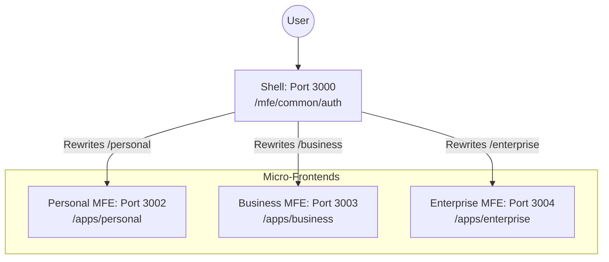

# Project Routing Architecture: Next.js Multi-Zones (BizzAI ERP)

This document provides a detailed explanation of how routing is handled in the BizzAI ERP monorepo using a **Next.js Multi-Zone** architecture.

## 🏛️ High-Level Architecture

The project is split into a **Shell (Auth MFE)** application and multiple **Micro-Frontends (MFEs)**. This allows different domains (Personal, Business, Enterprise) to be developed independently while the user experiences them as a single application.



---

## 🛰️ The Shell Application (`mfe/common/auth`)

The shell application acts as the primary gateway and router. It defines which path goes to which MFE service in [next.config.ts](file:///c:/Users/avmvi/Project/ERP/frontend/mfe/common/auth/next.config.ts).

### 1. Service URLs
The shell maps requests to specific local development ports:
- **Shell**: `http://localhost:3000`
- **Personal MFE**: `http://localhost:3002`
- **Business MFE**: `http://localhost:3003`
- **Enterprise MFE**: `http://localhost:3004` (Vite-based)
- **Backend Service**: `http://localhost:5000`

### 2. Rewrite Rules
Rewrites ensure that both page requests, internal Next.js/Vite assets, and **API calls** are fetched from the correct service.

**API Proxy:**
Provides a consolidated endpoint for all frontend modules, eliminating CORS and Referrer Policy issues.
```typescript
{
  source: '/api/:path*',
  destination: 'http://localhost:5000/api/:path*',
}
```

**Example Rewrite for Personal MFE:**
```typescript
{
  source: '/personal/_next/:path*',
  destination: 'http://localhost:3002/personal/_next/:path*',
},
{
  source: '/personal/:path*',
  destination: 'http://localhost:3002/personal/:path*',
}
```

---

## 🛠️ Micro-Frontend Configuration

For an MFE to work as a "Zone," it must be aware that it's being hosted under a subpath.

### Next.js MFEs (Personal, Business)
Configured in `next.config.ts` (e.g., [apps/personal/next.config.ts](file:///c:/Users/avmvi/Project/ERP/frontend/apps/personal/next.config.ts)).
1. **`basePath`**: Prefixes all routes (e.g., `/personal`).
2. **`assetPrefix`**: Ensures scripts are fetched via the correct prefix.

### Vite MFEs (Enterprise)
Configured in [vite.config.ts](file:///c:/Users/avmvi/Project/ERP/frontend/apps/enterprise/vite.config.ts).
1. **`base`**: Set to `/enterprise/`.
2. **`server.port`**: Set to `3004`.

---

## 🔄 Request Lifecycle

1. **User requests** `http://localhost:3000/personal/dashboard`.
2. **Shell (Port 3000)** receive the request.
3. **Rewrite**: The Shell matches `/personal/dashboard` and proxies the request to `http://localhost:3002/personal/dashboard`.
4. **Asset Loading**: The browser requests `/personal/_next/static/chunks/main.js`. The Shell rewrites this to Port 3002, returning the correct bundle.

## 📝 Configuration Locations

| App/MFE | Port | Base Path | Configuration File |
| :--- | :--- | :--- | :--- |
| **Shell (Auth)** | 3000 | `/` | [auth/next.config.ts](file:///c:/Users/avmvi/Project/ERP/frontend/mfe/common/auth/next.config.ts) |
| **Personal** | 3002 | `/personal` | [personal/next.config.ts](file:///c:/Users/avmvi/Project/ERP/frontend/apps/personal/next.config.ts) |
| **Business** | 3003 | `/business` | [business/next.config.ts](file:///c:/Users/avmvi/Project/ERP/frontend/apps/business/next.config.ts) |
| **Enterprise** | 3004 | `/enterprise` | [enterprise/vite.config.ts](file:///c:/Users/avmvi/Project/ERP/frontend/apps/enterprise/vite.config.ts) |
